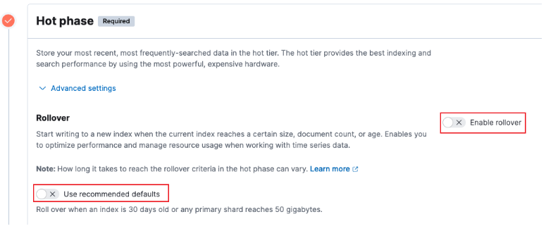
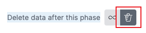
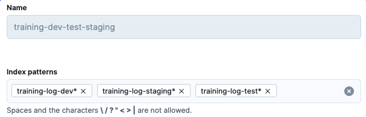
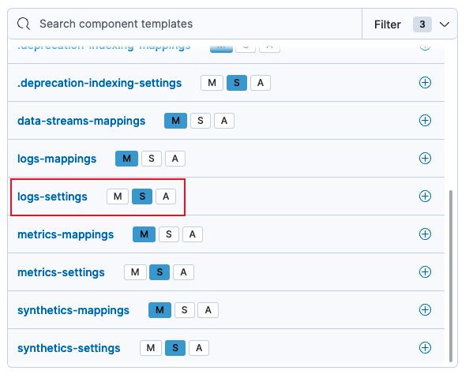

# kibana设置index自动删除策略

1. #### 创建**Index Lifecycle Policies**
   - 关闭滚动更新:
   
     
   - 开始自动删除功能:
   
     
   -  设置存活时间
   
     

1. #### 创建索引模版
   - 输入名字，及索引关键字
   
     
   - 第二步可查看设置模版
   
     

   - 第三步填写设置

   ```JSON
   {
     "index": {
       // 管理的生命周期策略
       "lifecycle": {
         "name": "training-dev-test-staging-7days"
       },
       // 压缩算法
       "codec": "best_compression",
       // 默认查询字段
       "query": {
         "default_field": [
           "trace","content","sql"
         ]
       }
     }
   }
   ```